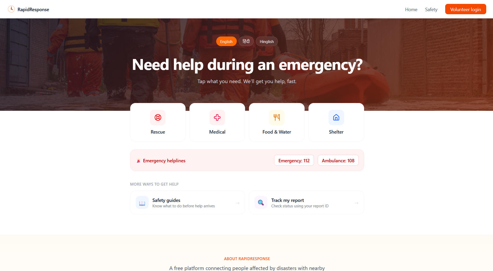
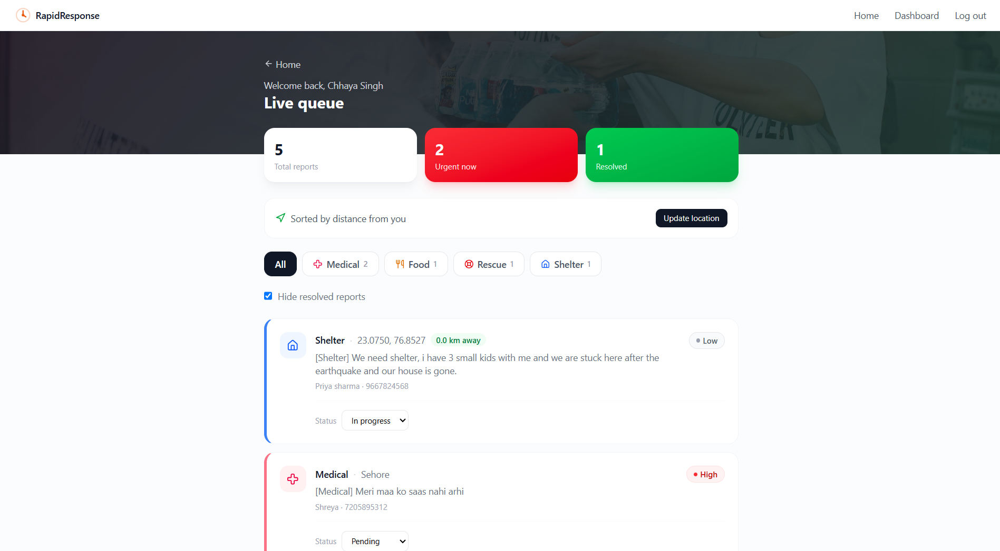
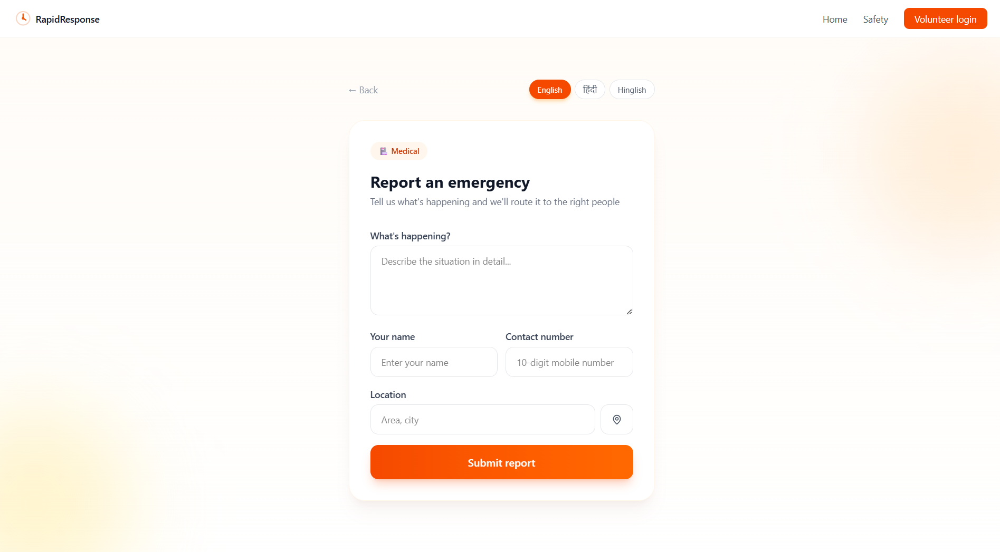
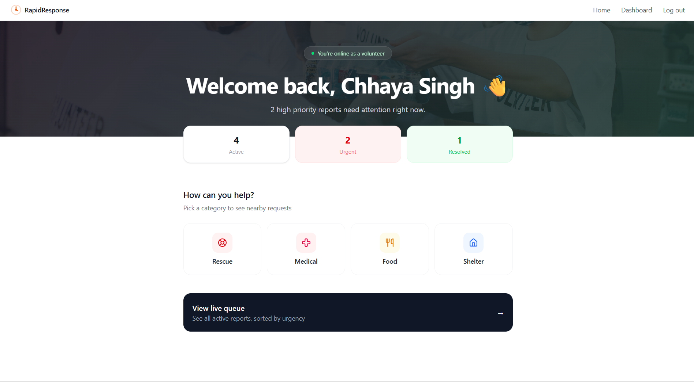
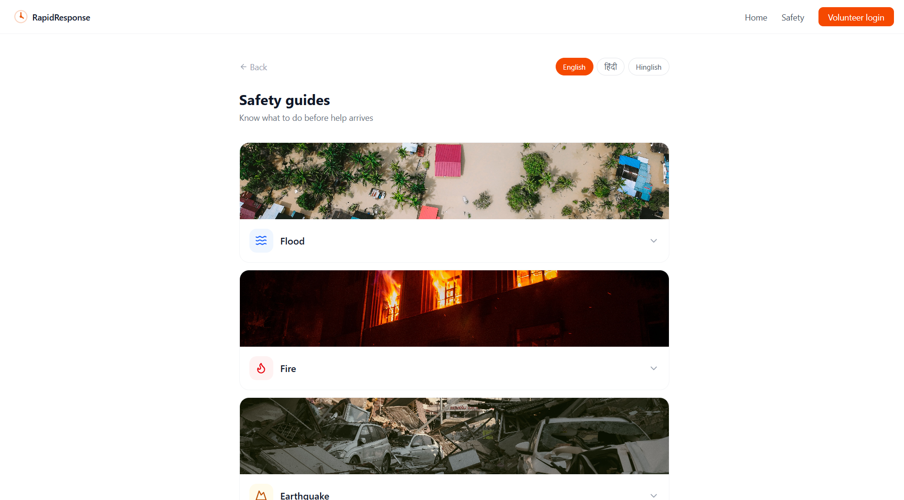

### AI-Powered Disaster Response Coordination Platform

Connecting people affected by emergencies with nearby volunteers — in their own language.

**Author:** Chhaya Singh · [GitHub](https://github.com/Chhayasingh18)

---

## Overview

During a disaster, every second matters — and language shouldn't be a barrier to getting help. **RapidResponse** is a full-stack platform where affected people can describe an emergency in English, Hindi, or Hinglish, have it automatically triaged by a trained machine learning model, and get it routed to nearby volunteers on a live coordination dashboard.

The project is built around two distinct journeys designed for two very different mental states — a person in distress who needs help *fast*, and a volunteer who needs to quickly understand what help is needed and where.

---

## Key Features

**🌐 Multilingual reporting** — the entire flow (reporting, tracking, safety guides) is available in English, Hindi, and Hinglish, so language is never a barrier during an emergency.

**🤖 AI-based triage** — an NLP classification model, trained on a multilingual dataset of distress messages, automatically assigns category (Medical / Food / Rescue / Shelter) and priority (High / Medium / Low) from free-text descriptions.

**👥 Role-aware experience** — the interface changes completely based on who's using it: a fast, icon-first reporting flow for citizens, and an operational live queue for logged-in volunteers.

**📍 Location-aware** — one-tap browser geolocation lets a victim share their exact location, and lets volunteers sort incoming requests by distance.

**🔍 Anonymous tracking** — anyone can check the live status of a submitted report using only its ID, without creating an account.

**📖 Visual safety guides** — quick, scannable do's and don'ts for flood, fire, earthquake, and cyclone, available in all three supported languages.

**🔐 Secure authentication** — JWT-based volunteer login and registration, with BCrypt password hashing and protected routes.

**🛡️ Fault-tolerant classification** — if the AI microservice is ever unreachable, the backend automatically falls back to a rule-based classifier rather than failing the request, so the core emergency-reporting flow never breaks.

---

## Tech Stack

| Layer | Technology |
|---|---|
| **Frontend** | React (Vite), Tailwind CSS, React Router, Lucide Icons |
| **Backend** | Java, Spring Boot, Spring Security, Spring Data JPA |
| **AI Service** | Python, Flask, scikit-learn, pandas |
| **Database** | MySQL |
| **Authentication** | JWT, BCrypt |
| **Deployment** | Vercel · Render (Docker) · Railway |

---

## System Architecture

React (Vercel)
│ REST API
▼
Spring Boot Backend (Render)
│
┌─────┴─────┐
▼ ▼
MySQL Python AI Microservice
(Railway) (Render)

The backend follows a layered architecture (Controller → Service → Repository) and communicates with the AI microservice over REST. Classification logic is decoupled from the core application so the ML component can be retrained or replaced independently.

---

## What I Built

This was designed and built end-to-end as a solo full-stack + AI project:

- Designed and implemented the full REST API in Spring Boot, including JWT authentication, role-based access considerations, and a layered service architecture
- Trained a multilingual text classification model from scratch using scikit-learn, including dataset curation and class-imbalance handling
- Built the entire frontend UI/UX from the ground up — including two distinct role-based interfaces, multilingual support, and a mobile-first responsive design
- Containerized and deployed all three services independently (Vercel, Render, Railway), with environment-based configuration for local vs. production
- Designed the system to degrade gracefully rather than fail, particularly around the AI service dependency

---

## Roadmap

- [ ] Interactive map view for volunteers (Leaflet + OpenStreetMap)
- [ ] Offline support for low-connectivity areas
- [ ] Real-time status notifications
- [ ] Expanded, continuously-retrained classification dataset

---

**© 2026 Chhaya Singh. All rights reserved.**
This project is shared publicly for portfolio and demonstration purposes.
Please do not reproduce or redistribute without permission.

